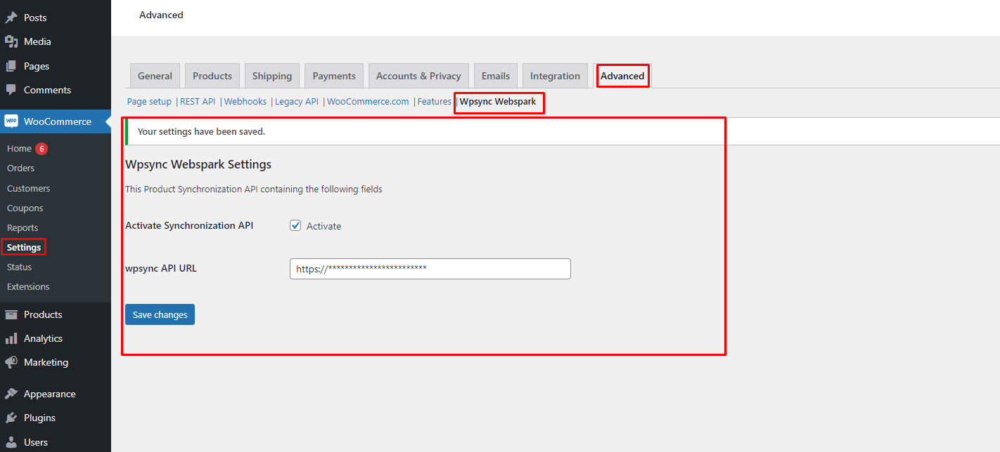

# wpsync webspark

Synchronization of the goods database with the remains

This Product Synchronization API containing the following fields
> -   sku.
> -   name.
> -   description.
> -   price.
> -   picture.
> -   in_stock.

## Requirements

Wpsync webspark plugin requires [WooCommerce 3.5.1 or newer](https://wordpress.org/plugins/woocommerce/).

## Installation

> -   I. Upload the folder to the `/wp-content/plugins/` directory.
> -   II. Activate the plugin through the "Plugins" menu in WordPress.

## Activation

After installing and activating the plugin
WooCommerce Advanced Settings (WooCommerce > Settings > Advanced > Wpsync Webspark)
> - Activate Synchronization API.
> - Add wpsync API.
> - Save changes.

